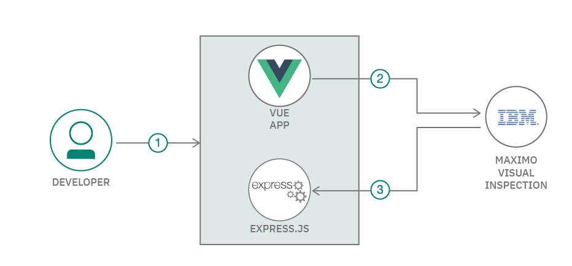

# WARNING: This repository is no longer maintained

> This repository will not be updated. The repository will be kept available in read-only mode.

# Generate and visualize video analytics using IBM Maximo Visual Inspection

In this Code Pattern we will show how to deploy a customizable dashboard to visualize video/image analytics. This dashboard enables users to upload images to be processed by IBM Maximo Visual Inspection (object recognition, image classification), download the analyzed results, and view analytics via interactive graphs.

When the reader has completed this Code Pattern, they will understand how to build a dashboard using Vue.js and Maximo Visual Inspection APIs to generate and visualize image analytics.

<!-- The intended audience for this Code Pattern is application developers and other stakeholders who wish to utilize the power of Maximo Asset Monitor to quickly and effectively monitor any asset to ensure availability, utilization and efficiency. -->


<!--  -->



#  Components

* [IBM Maximo Visual Inspection](https://www.ibm.com/us-en/marketplace/ibm-powerai-vision). This is an image analysis platform that allows you to build and manage computer vision models, upload and annotate images, and deploy apis to analyze images and videos.

Sign up for a trial account of IBM Maximo Visual Inspection [here](https://developer.ibm.com/linuxonpower/deep-learning-powerai/try-powerai/). This link includes options to provision a IBM Maximo Visual Inspection instance either locally on in the cloud.


# Flow

1. Upload images to IBM Maximo Visual Inspection
2. Label uploaded images to train model
3. Deploy model
4. Upload image via dashboard
5. View processed image and graphs in dashboard

# Prerequisites

* An account on IBM Marketplace that has access to IBM Maximo Visual Inspection. This service can be provisioned [here](https://developer.ibm.com/linuxonpower/deep-learning-powerai/vision/access-registration-form/)

# Steps

Follow these steps to setup and run this Code Pattern.

1. [Upload training images to IBM Maximo Visual Inspection ](#1-upload-training-images-to-IBM-Visual-Insights)
2. [Train and deploy model in IBM Maximo Visual Inspection](#2-Train-and-deploy-model-in-IBM-Visual-Insights)
3. [Clone repository](#3-clone-repository)
4. [Deploy dashboard](#4-Deploy-dashboard)
5. [Upload images to be processed via dashboard](#5-Upload-images-to-be-processed-via-dashboard)
6. [View processed images and graphs in dashboard](#6-View-images-and-graphs-in-dashboard)

<!-- 5. [Create a Dashboard](#4-create-dashboard) -->

## 1. Upload training images to IBM Maximo Visual Inspection

Login to IBM Maximo Visual Inspection Dashboard


To build a model, we'll first need to upload a set of images. Click "Datasets" in the upper menu. Then, click "Create New Data Set", and enter a name. We'll use "traffic_long" here


Drag and drop one or more images to build your dataset.


## 2. Train and deploy model in IBM Maximo Visual Inspection

In this example, we'll build an object recognition model to identify specific objects in each frame of a video. After the images have completed uploading to the dataset, select one or more images in the dataset, and then select "Label Objects".


Next, we'll split the training video into multiple frames. We'll label objects in a few of the frames manually. After generating a model, we can automatically label the rest of the frames to increase accuracy.


Identify what kinds of objects will need to be recognized. Click "Add Label", and type the name of each object. In this case, we're detecting traffic on a freeway, so we'll set our objects as "car", "truck", and "bus".


We can then manually annotate objects by
1. Selecting a video frame
2. Selecting an object type
3. Drawing a rectangle (or custom shape) around object in frame


After annotating a few frames, we can then build a model. Do so by going back to the "Datasets" view, selecting your dataset, and then selecting "Train Model"


Select type of Model you'd like to build. In this case, we'll use "Object Detection" as our model type, and "Detectron" as our model optimizer. Then, click the "Train Model" button.


After the model completes training, click the "Models" button in the upper menu. Then, select the model and then click the "Deploy Model" button.


Deploying the custom will establish an endpoint where images and videos can be uploaded, either through the UI or through a REST API endpoint.


## 3. Clone repository

Clone repository using the git cli

```
git clone https://github.com/ansari-akram/powerai_vision_dashboard
```

### Install Node.js packages

If expecting to run this application locally, please install [Node.js](https://nodejs.org/en/) and NPM. Windows users can use the installer at the link [here](https://nodejs.org/en/download/)

If you're using Mac OS X or Linux, and your system requires additional versions of node for other projects, we'd suggest using [nvm](https://github.com/creationix/nvm) to easily switch between node versions. Install nvm with the following commands

```bash
curl -o- https://raw.githubusercontent.com/creationix/nvm/v0.33.11/install.sh | bash
# Place next three lines in ~/.bash_profile
export NVM_DIR="$HOME/.nvm"
[ -s "$NVM_DIR/nvm.sh" ] && \. "$NVM_DIR/nvm.sh"  # This loads nvm
[ -s "$NVM_DIR/bash_completion" ] && \. "$NVM_DIR/bash_completion"  # This loads nvm bash_completion
```


```
nvm install v8.9.0
nvm use 8.9.0
```

Also install [ffmpeg](https://www.ffmpeg.org/) using on of the following command, depending on your operating system. ffmpeg enables the app to receive metadata describing the analyzed videos.

This may take a while (10-15 minutes).

```
# OS X
brew install ffmpeg

# Linux
sudo apt install ffmpeg -y
```

To run the dashboard locally, we'll need to install a few node libraries which are listed in our `package.json` file.
- [Vue.js](https://vuejs.org/): Used to simplify the generation of front-end components
- [Express.js](https://expressjs.org/): Used to provide custom api endpoints

These libraries can be installed by entering the following commands in a terminal.

```
cd visual_insights_dashboard
```

```
cd backend
npm install
cd ..
cd frontend
npm install
```


## 4. Deploy dashboard

After installing the prerequisites, we can start the dashboard application.

<!-- First, enter your PowerAI credentials into a env file at `backend/.env`. This will include a URL, username, and password. -->

Run the following to start the backend
```
cd backend
npm start
```

In a separate terminal, run the following to start the frontend UI
```
cd frontend
npm run serve
```


Confirm you can access the Dashboard UI at [http://localhost:8080](http://localhost:8080).


Click the Login button at the top and enter your IBM Maximo Visual Inspection credentials. These credentials should be included in the welcome letter when your PowerAI instance provisioned. This input form requires a username, password, and url where the instance can be accessed.


## 5. Upload images to be processed via dashboard

After providing our IBM Maximo Visual Inspection credentials, we can then use the dashboard to
Let's upload a video or image to be processed by our custom model. We'll do this by clicking the "Upload Image(s)" button in the upper menu. Then, drag and drop images that need to be analyzed. Select a model from the selection dropbox, and then click the "Upload" button.


## 6. View processed images and graphs in dashboard

As images are uploaded to the IBM Maximo Visual Inspection service, they'll be shown in a grid in the main dashboard view. We can use the "Search" input to filter the image analysis results by time, model id, object type, etc. Also, the annotated images can be downloaded as a zip file by clicking the "Download Images" button.

Select any of the images to open a detailed view for a video/image. This detailed view will show the original image/video, as well as a few graphs showing basic video analytics, such as a breakdown of objects detected per second (line graph), and a comparison of total detected objects by type (circle graph).


# Learn more

<!-- * **Watson IOT Platform Code Patterns**: Enjoyed this Code Pattern? Check out our other [Watson IOT Platform Code Patterns](https://developer.ibm.com/?s=Watson+IOT+Platform). -->

<!-- * **Knowledge Center**:Understand how this Python function can load data into  [Watson IOT Platform Analytics](https://www.ibm.com/support/knowledgecenter/en/SSQP8H/iot/analytics/as_overview.html) -->

# License

This code pattern is licensed under the Apache Software License, Version 2.  Separate third party code objects invoked within this code pattern are licensed by their respective providers pursuant to their own separate licenses. Contributions are subject to the [Developer Certificate of Origin, Version 1.1 (DCO)](https://developercertificate.org/) and the [Apache Software License, Version 2](https://www.apache.org/licenses/LICENSE-2.0.txt).

[Apache Software License (ASL) FAQ](https://www.apache.org/foundation/license-faq.html#WhatDoesItMEAN)
